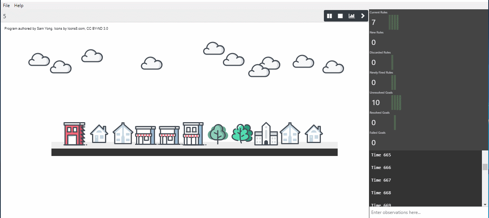

# LPS Studio

<p align="center">

</p>

LPS Studio is an interactive storytelling tool for visualisng Logic Production System (LPS) programs using the [lps.js](https://github.com/mauris/lps.js) interpreter on top of using Electron and Angular frameworks. 

Standalone and self-contained installers for various platforms are available in the [LPS Studio Releases page](https://github.com/mauris/lps-studio/releases).



## Setup

To setup for development, ensure you have Node.js and npm installed on your system. After cloning this repository, install all dependencies using:

```
npm install
```

Once all dependencies are installed, you can run an instance of LPS Studio by running the command:

```
npm run electron:local
```

If incompatible Node.js or npm version warnings show up, follow the instructions given and update your Node.js / npm as required. Angular compilation requires at least Node.js v8.9 or newer.

## Packaging

To package LPS Studio for distribution, you will need to run one of the following commands:

- For Windows (`msi` and Setup): `npm run electron:windows`
- For macOS (DMG): `npm run electron:mac`
- For Linux (AppImage and Debian): `npm run electron:linux`
- For all three paltforms: `npm run electron:all`

## License

LPS Studio is open source and licensed under the BSD 3-Clause. The implementation depends on the LPS runtime [lps.js](https://github.com/mauris/lps.js) and several other open source . lps.js was implemented as part of Sam Yong's MSc Computer Science Individual Project and thesis at Imperial College London in 2018.

Images and illustrations in this repository, otherwise explicitly stated, are made by Sam Yong and are licensed under CC BY-NC-SA 3.0.
